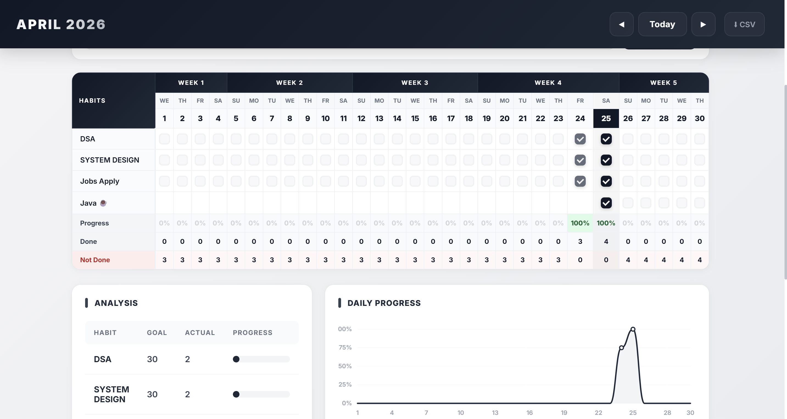

<div align="center">
  <h1>📈 Premium Progress Tracker</h1>

  **A sleek, responsive, and data-driven habit tracking application.**  
  Track your daily goals, monitor consistency, and build long-lasting habits with a clean, editorial-inspired UI.

  [](#)
  [](#)
  [](#)

  <br />
  <br />

  
</div>

---

## ✨ Features

- **Intuitive Monthly Grid:** A clear, beautifully spaced grid to check off daily habits at a glance.
- **GitHub-style Yearly Heatmap:** Visually track your consistency over the entire year with a dynamic contribution heatmap.
- **Advanced Analytics:** Automatically calculates your *Longest Streak*, *Overall Consistency %*, and your *Best Day of the Week*.
- **Interactive UI Feedback:** Includes subtle sound effects, automatic emoji assignments for new habits, and smooth hover animations.
- **Undo Functionality:** Accidentally checked off a day? Simply press `Ctrl + Z` to undo your last action.
- **Data Export:** Export all of your habit data instantly to a clean `.csv` file.
- **Cloud Sync:** Backend powered by Express & MongoDB ensures your data is saved and synced in real-time.

---

## 🛠️ Tech Stack

### Frontend
- **HTML5 & CSS3:** Custom, utility-free CSS utilizing CSS Variables for a fast, glassmorphic, and highly polished aesthetic.
- **Vanilla JavaScript:** Zero-dependency frontend handling complex DOM rendering, state management, and the undo stack.
- **Chart.js:** For rendering the smooth, dynamic daily progress curve in the Analytics section.

### Backend
- **Node.js & Express:** Lightweight REST API to handle data persistence.
- **MongoDB & Mongoose:** Cloud database storage ensuring data integrity.
- **Zod:** Robust schema validation for incoming API requests.

---

## 🚀 Quick Start (Local Development)

To run this project locally on your machine, follow these steps:

### 1. Clone the repository
```bash
git clone https://github.com/SHAIKHANIF2004/Habit-Tracker.git
cd Habit-Tracker
```

### 2. Install Dependencies
```bash
npm install
```

### 3. Setup Environment Variables
Create a `.env` file in the root directory and add your MongoDB connection string:
```env
MONGO_URI=mongodb+srv://<username>:<password>@cluster0.mongodb.net/ProgressTracker
```

### 4. Start the Server
```bash
# Start with nodemon for live-reloading
npm run dev

# Or start normally
npm start
```
*The server will start on `http://localhost:3000`.*

---

## ☁️ Deployment

This application is fully optimized for deployment on **Vercel**. 

The repository includes a `vercel.json` configuration file that automatically routes the frontend static assets and points API requests to the serverless backend.

1. Import the repository into Vercel.
2. Add your `MONGO_URI` in the Vercel Environment Variables settings.
3. Click **Deploy**.

---

<div align="center">
  <i>Designed and built to make habit building beautiful.</i>
</div>
